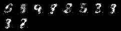

# GAN Tutorials

From this Original GAN, GAN Tutorials with Study-friendly Pytorch and Tensorflow Code will be Uploaded Continuously.

All Pytorch Codes are Made by [Taeoh Kim](https://github.com/taeoh-kim)

All Tensorflow Codes are Made by [Hyeongmin Lee](https://github.com/HyeongminLEE)

- GAN: [[Pytorch](https://github.com/taeoh-kim/GANin50lines)][[Tensorflow](https://github.com/HyeongminLEE/GANin50lines)]
- DCGAN: [[Pytorch](https://github.com/taeoh-kim/Pytorch_DCGAN)][[Tensorflow](https://github.com/HyeongminLEE/Tensorflow_DCGAN)]
- InfoGAN: [[Pytorch](https://github.com/taeoh-kim/Pytorch_InfoGAN)][Tensorflow]
- Pix2Pix: [[Pytorch](https://github.com/taeoh-kim/Pytorch_Pix2Pix)][Tensorflow]
- DiscoGAN: [[Pytorch](https://github.com/taeoh-kim/Pytorch_DiscoGAN)][Tensorflow]

# GAN in 50 lines (Pytorch)

Very Simple Implementation of Vanilla GAN (I. Goodfellow, 2014)

- Pytorch 0.2.0
- Torchvision

In Tensorflow: [Link](https://github.com/HyeongminLEE/GANin50lines)

## Networks

#### Generator

- Noise - Fully Connected - ReLU - Fully Connected - Sigmoid

#### Discriminator

- Image - Fully Connected - ReLU - Fully Connected - Sigmoid

## Train

```bash
python GAN.py
```

## Results

#### Epoch 0 (Initial)

<p align="center"></p>

#### Epoch 5

<p align="center"></p>

#### Epoch 10

<p align="center"></p>

#### Epoch 50

<p align="center"></p>

#### Epoch 100

<p align="center"></p>

#### Epoch 150

<p align="center"></p>


